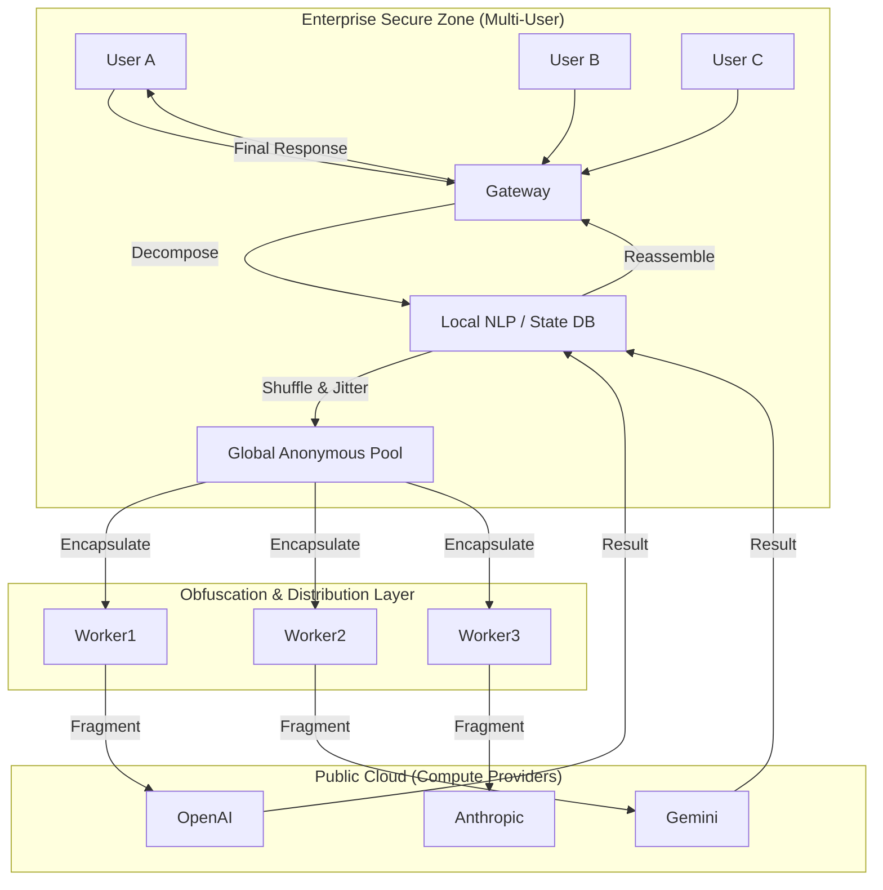

# ShadowMixer — AI 时代的 Tor 与混币器

ShadowMixer 是一个开源的 AI 隐私混币器和零信任网关。受 Tor 和 CoinJoin 启发，它利用碎片化混淆技术（Fragmented Obfuscation）将智能与身份解耦，将大模型提供商降级为盲目的算力供应商。通过语义多租户匿名性保护您的意图和业务逻辑。

本项目不仅是开发者的利器，更是构建 **AI 安全关口（AI Security Gateway）** 的核心引擎。在多用户并发环境下，ShadowMixer 会产生强大的“群体掩护”效应，让追踪单个用户的商业意图在统计学上变得几乎不可能。

> 💡 **核心比喻：“消失在人海里的红烧肉”**
>
> 你想吃红烧肉，但不想让外界知道食谱。ShadowMixer 将食材切碎，混入全城成千上万人的食材订单中，随机分发给不同的厨师（LLM 厂商）。厨师们只看到无数人在买“糖、肉、酱油”，却无法拼凑出谁要吃红烧肉，更无法偷走你的独家秘方。
ll
## ✨ 核心安全特性

1. **群体匿名效应 (Crowd Anonymity)**
   - **多租户混淆**：不同用户的任务碎片进入同一个全局调度池。在大模型厂商看来，这些请求序列是交织在一起的“语义流”，无法通过 IP 或 API Key 区分行为边界。
   - **网络规模增益**：用户越多，隐私越强。随着并发量增加，单个用户的特征会被淹没在海量的背景噪声中，彻底瓦解厂商的用户画像能力。

2. **拟人化外壳与算力节约 (Anthropomorphic Shell & Efficiency)**
   - **防风控伪装**：为干瘪的碎片穿上自然语言“外壳”，使其看起来像合法的、独立的咨询请求，规避厂商的输入完整性校验。
   - **零算力浪费 (Zero Compute Waste)**：ShadowMixer 专注于高效混淆，**绝不通过发送无效请求来浪费宝贵的算力资源**。每一分算力都用于真实的业务价值。

3. **本地状态机与分层路由 (Local State & Tiered Routing)**
   - **逻辑重组**：本地数据库实时维护任务状态，无需将上下文传回云端。
   - **隐私分级**：极高密级任务本地小模型处理，计算型任务云端混淆处理。

## ⚙️ 核心工作流

1. **分解与脱敏 (Decompose & Mask)**：将复杂指令拆解为 $N$ 个原子碎片，并在本地完成实体加密/占位。
2. **群体注入 (Shuffle & Inject)**：将所有用户的碎片混入高并发池，加入随机延迟（Jitter）和顺序打乱。
3. **算力路由 (Compute Routing)**：Worker 节点从池中捞取碎片，利用 Key Pooling 分布式请求上游厂商。
4. **智能聚合 (Reassemble)**：聚合器根据 TaskID 剥离外壳、滤除噪声、还原实体，将拼装好的结果交付用户。

## 🎯 适用场景

- **企业 AI 隐私防火墙**：解决企业员工违规使用 ChatGPT 泄露代码、商业计划书的合规痛点。
- **去中心化 AI 安全代理**：作为 Agent 的安全通信层，阻断云端对企业“思考链”的侦听。
- **数据资产脱敏中台**：医疗、金融领域在合规前提下利用公有云算力进行超大规模文档处理。
- **低成本隐私替代方案**：相比于联邦大模型（Federated LLM）极高的算力门槛与复杂的跨机构协同成本，ShadowMixer 提供了一种“零基础设施”的隐私保护路径。
- **公有云能力平替**：企业无需构建昂贵的本地 GPU 集群进行模型训练或微调，即可在保障私域数据安全的前提下，直接调动公有云顶尖模型的推理能力，极大地降低了 AI 合规的 TCO（总拥有成本）。

## 🗺️ 架构图



## 🚀 快速开始

### 1. 启动安全引擎

本项目已完全重写为 Rust 版本，以获得最大的安全性和性能。

#### 选项 A: 本地运行 (开发推荐)
确保已安装 Rust 和 Redis。

```bash
# 在默认端口 6379 启动 Redis
cargo run --release
```

#### 选项 B: Docker 部署
```bash
# 部署 ShadowMixer 多用户隐私集群
docker-compose up --build -d
```

### 2. 配置

ShadowMixer 通过环境变量 (或 `.env` 文件) 进行配置。

| 变量名 | 默认值 | 描述 |
|----------|---------|-------------|
| `REDIS_URL` | `redis://127.0.0.1:6379/0` | Redis 连接 URL |
| `SERVER_PORT` | `0.0.0.0:8080` | HTTP 服务监听地址 |
| `LLM_API_KEYS` | (空) | 逗号分隔的供应商 API Key 列表 |
| `LLM_TARGET_URL` | `https://api.openai.com...` | 上游 API 端点 |
| `LOCAL_MASKING` | `true` | 启用本地 PII 脱敏 |

### 3. API 调用

ShadowMixer 支持 `session_id` 进行多轮对话。

```bash
curl -X POST http://localhost:8080/v1/secure/chat \
  -H "Content-Type: application/json" \
  -d '{
    "model": "gpt-4",
    "session_id": "my-secret-session",
    "messages": [{"role": "user", "content": "分析这份代码..."}]
  }'
```


---

# ShadowMixer — Tor & Mixer for the AI Era

ShadowMixer is an open-source AI privacy mixer and zero-trust gateway. Inspired by Tor and CoinJoin, it uses Fragmented Obfuscation to decouple intelligence from identity, downgrading LLM providers into blind compute vendors. Protect your intent and business logic through semantic multi-tenant anonymity.

This project is not just a tool for developers but the core engine for building an **AI Security Gateway**. In a multi-user concurrent environment, ShadowMixer generates a powerful "crowd cover" effect, making it statistically impossible to trace the commercial intent of a single user.

> 💡 **Core Analogy: "The Braised Pork in the Crowd"**
>
> You want to eat braised pork, but you don't want the outside world to know the recipe. ShadowMixer chops the ingredients and mixes them into the orders of thousands of people across the city, distributing them randomly to different chefs (LLM vendors). The chefs only see countless people buying "sugar, meat, soy sauce," but they cannot piece together who is eating braised pork, nor can they steal your exclusive recipe.

## ✨ Core Security Features

1. **Crowd Anonymity**
   - **Multi-Tenant Obfuscation**: Task fragments from different users enter the same global scheduling pool. To LLM vendors, these request sequences appear as interwoven "semantic streams," indistinguishable by IP or API Key boundaries.
   - **Network Scale Gain**: The more users, the stronger the privacy. As concurrency increases, a single user's characteristics are drowned out in massive background noise, completely dismantling the vendor's user profiling capabilities.

2. **Anthropomorphic Shell & Efficiency**
   - **Anti-Risk Control Camouflage**: Wraps dry fragments in a natural language "shell" to make them look like legitimate, independent inquiries, bypassing vendor input integrity checks.
   - **Zero Compute Waste**: ShadowMixer focuses on efficient obfuscation and **never wastes precious compute resources by sending invalid requests**. Every bit of compute is used for real business value.

3. **Local State & Tiered Routing**
   - **Logic Reassembly**: A local database maintains task state in real-time, eliminating the need to send context back to the cloud.
   - **Privacy Tiering**: Extremely sensitive tasks are handled by local small models, while computational tasks are processed via cloud obfuscation.

## ⚙️ Core Workflow

1. **Decompose & Mask**: Decomposes complex instructions into $N$ atomic fragments and performs entity encryption/masking locally.
2. **Shuffle & Inject**: Mixes all user fragments into a high-concurrency pool, adding random delays (Jitter) and shuffling the order.
3. **Compute Routing**: Worker nodes retrieve fragments from the pool and use Key Pooling to distribute requests to upstream vendors.
4. **Reassemble**: The aggregator strips shells, filters noise, restores entities based on TaskID, and delivers the assembled result to the user.

## 🎯 Use Cases

- **Enterprise AI Privacy Firewall**: Solves compliance issues where employees leak code or business plans while using ChatGPT.
- **Decentralized AI Security Agent**: Acts as a secure communication layer for Agents, blocking cloud eavesdropping on the enterprise "chain of thought."
- **Data Asset Desensitization Hub**: Enables healthcare and finance sectors to use public cloud compute for massive document processing under compliance.
- **Low-Cost Privacy Alternative**: Compared to the high compute threshold and complex cross-organization coordination of Federated LLMs, ShadowMixer offers a "zero infrastructure" privacy protection path.
- **Public Cloud Capability Replacement**: Enterprises can leverage top-tier public cloud model inference without building expensive local GPU clusters for training or fine-tuning, significantly reducing the TCO of AI compliance while ensuring data safety.

## 🗺️ Architecture Diagram


## 🚀 Quick Start

### 1. Start the Security Engine

The project has been completely rewritten in Rust for maximum security and performance.

#### Option A: Run Locally (Recommended for Development)
Ensure you have Rust and Redis installed.

```bash
# Start Redis locally on default port 6379
cargo run --release
```

#### Option B: Docker Deployment
```bash
# Deploy ShadowMixer Multi-User Privacy Cluster
docker-compose up --build -d
```

### 2. Configuration

ShadowMixer is configured via environment variables (or `.env` file).

| Variable | Default | Description |
|----------|---------|-------------|
| `REDIS_URL` | `redis://127.0.0.1:6379/0` | Redis connection URL |
| `SERVER_PORT` | `0.0.0.0:8080` | HTTP Server binding |
| `LLM_API_KEYS` | (Empty) | Comma-separated list of provider keys |
| `LLM_TARGET_URL` | `https://api.openai.com...` | Upstream API Endpoint |
| `LOCAL_MASKING` | `true` | Enable local PII sanitization |

### 3. API Usage

ShadowMixer supports `session_id` for multi-turn conversations.

```bash
curl -X POST http://localhost:8080/v1/secure/chat \
  -H "Content-Type: application/json" \
  -d '{
    "model": "gpt-4",
    "session_id": "my-secret-session",
    "messages": [{"role": "user", "content": "Analyze this code..."}]
  }'
```
